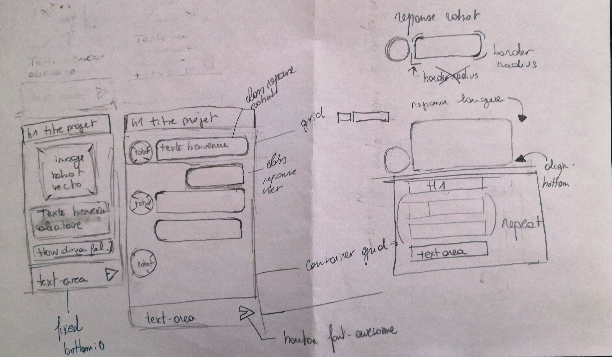

# KingLeo-micro-chatbot
Création d'une interface utilisateur avec Chatbot... 
#### Nathalie Anneessens | Guillaume-Leo | Robbert Klockaerts | Christian Jadot

***

## Table des matières
1. [Les Étapes](#Les-Etapes)
2. [Organisation du travail](#Organisation-du-travail)
3. [La Mission](#La-Mission)
4. [Les Compétences](#Les-Compétences)
5. [Lien vers notre chatbot](#Lien-vers-notre-chatbot)
6. [Page Github](#Page-Github)
7. [LightHouse résultats](#LightHouse)
8. [Layout](#Layout)

***

## Les Étapes
1. Création branch dev
2. Création branch individuelles & FrontEnd / BackEnd
3. Discussion sur le travail à réaliser
4. Répartition des tâches Front / Back
5. Démarrage de la Mission

## Organisation du travail
- Création des équipes :
  - FrontEnd: Nathalie Anneessens & Christian Jadot
  - BackEnd: Guillaume & Robbert Klockaerts
  - gestion de projet: Christian Jadot

- Stratégie de déploiement:
  - Page Github
  - Mise en route de l'équipe Front & BackEnd

- Délais des réalisations
  - FrontEnd :
    - 15/02 :
      - Création du layout, validation par l'équipe et démarrage de la mise en HTML/CSS. 
      - Création du layout de la conversation. 
      - Création de la structure dans le fichier html avec simulation de message et mise en page sommaire/fonctionnelle en CSS : 
        - Adapter la taille de la bulle à la taille du contenu. 
        - Aligner la bulle de l'utilisateur à droite. 
        - Fixer le formulaire avec le text-area en bas. 
    - 16/02 :
      - Recherche du style visuel global, visuel du Bot, création d'un logo, interface générale, nuances. 
      - Regarder comment empêcher le resizing manuel d'un "textarea". 
      - Adaptation du design sur base des fichiers de Christian. 
      - Recherche sur les iframes. 
      - Intégrer le contenu. 
      - Empêcher le resizing manuel d'un textarea et le faire s'adapter aux textes. 
      - Adapter le design avec les fichiers de Christian (couleurs, avatars, import du logo dans le header). 
      - Enlever les margin en trop des balises "pre" !. 
      - Forcer la font Roboto pour les balises "pre" et voir si ca fonctionne. 
      - Changer pour le background v2. 
      - Adapter pour ne garder qu'un scroll vertical sur l'historique messages et pas sur l'interface entière. 
      - Maquette de la page de présentation -> Christian. 
      - Page de présentation -> Christian. 
      - Inclure les typos et une hauteur de 100vh dans la page Index. 
    - 17/02 :
      - Faire démarre les messages apr le bas (Merci Guillaume !). 
      - Faire le JS du bouton pour qu'il "display" le chatbot. 
      - Vérifier les espaces pour l'index en responsive. 
      - Vérifier les padding dans "old messages". 
      - Mise en place du lien GitHub sur l'index.html

  - BackEnd :
    - 15/02 :
      - Tests sur les séquences des messages. 
      - Analyse des faisabilités pour l'insertion de message dans du "textarea". 
      - Vérifier les dispositions des éléments dans l'ordre souhaité, vertical de bas en haut et gauche et droite, à gauche pour les messages de "KingLeo", à droite pour les messages "utilisateurs". 
      - Test de la mise en place d'une stratégie de travail à deux (Guillaume et Robbert) sur une branche commune "backend". 
      - Prise de la décision que "KingLeo" analyserait les phrases entrées par l'utilisateur à l'aide d'une "regex". En trouvant des patterns plus complexes que "oui" ou "non" dans la phrase, "KingLeo" pourrait mieux interpréter si la réponse de l'utilisateur à une nuance positive ou négative. 
      - Test pour créer des bulles de conversation de manière dynamique dans le document html à l'aide de javascript, afin de  comprendre le fonctionement et prendre en main cette technique. 
    - 16/02 :
      - REGEX et son "monde merveilleux". La totalité de la journée a été consacrée à essayer d'apprivoiser ce systeme très complexe. 
      - Nos tentatives de mettre en place cette technique REGEX dans le cadre de ce projet se sont avérées infructueuses. Que de frustration... dommage. 
      - Il faut avancer et donc trouver autre chose. 
      - Cette partie a été mise de côté pour avancer sur la création des fonctions principales qui déclenchent une suite d'instructions (envoi de message de l'utilisateur / création des messages KingLeo etc.). 
    - 17/02 :
      - La matiné a été utilisée pour finir le code JS. 
      - L'après midi pour "merger" le travail du BackEnd avec le FrontEnd. 
      - Tout le code a été rendu plus lisible en y ajoutant un maximum de commentaires.

## La Mission
### Créer un chatbot
#### Fonctionnalités indispensables
Tout d'abord, vous aurez besoin d'une interface utilisateur, qui est juste une liste de messages (il existe deux types de messages - ceux des bots et ceux de l'utilisateur) et une zone de texte avec un bouton d' envoi. 
L'envoi d'un message au bot se fait en cliquant sur le bouton d' envoi ou en tapant ENTER. 
au chargement de la page, le bot accueille l'utilisateur avec un message d'accueil aléatoire (votre bot a besoin d' au moins trois messages d'accueil différents ), puis il demande à l'utilisateur "comment vous sentez-vous aujourd'hui?". 
L'utilisateur peut répondre librement, et le bot doit vérifier la réponse s'il peut trouver un "oui" ou un "non": 
si le script trouve un "oui" dans le message, le bot répond avec une phrase aléatoire d'un ensemble spécifique (minimum trois différents ) 
si le script trouve un "non" dans le message, le bot répond avec une phrase aléatoire d'un ensemble spécifique (minimum trois différents ) 
si le script ne trouve pas un "oui" ou un "non" dans le message, le bot répondra par exemple "Je n'ai pas compris, pouvez-vous réessayer s'il vous plaît". 
si le script ne peut pas trouver un "oui" ou un "non" dans le message après trois tentatives, le bot commence à être fou et utilise une réponse "passive-agressive", comme "mec, es-tu sûr que tu peux lire ?". 
Après cette réponse, le bot a terminé sa routine. Il dit "au revoir" à l'utilisateur et la zone de texte passe en disabledmode.
#### Fonctionnalités bonus
- Prend en charge les messages multilignes : en tapant SHIFT+ENTER, vous créez une nouvelle ligne dans la zone de texte.
- Ajouter une animation "en cours" et un délai d'expiration pour simuler la "pensée de bot"
- Vous pouvez essayer de rendre le bot plus "réel" en ayant plus de réponses possibles pour interagir avec l'utilisateur.

## Les Compétences
- Compétences ** JavaScript **
- Compétences ** HTML5 / CSS3 / Bootstrap / Flex / Grid ** 
- compétences d'équipe
- compétences de conflit git

## Lien vers notre chatbot
[Voici le KingLeo Micro Chatbot](lien à copier/coller ici)

## Page Github
L'ensemble des éléments "Pages et dossiers" ont été placés sur Github.   
Voici le repo sur [Github](https://github.com/ChristianJadot/KingLeo-micro-chatbot/) 

## LightHouse résultats
Résultat de l'analyse faite par l'application LightHouse-Google.   
Voici ce résultat [LightHouse View](https://googlechrome.github.io/lighthouse/viewer/?psiurl=https%3A%2F%2Fchristianjadot.github.io%2FKingLeo-micro-chatbot%2F&strategy=mobile&category=performance&category=accessibility&category=best-practices&category=seo&category=pwa&utm_source=lh-chrome-ext) 

## Layout
Ci-dessous les mock-up du site KingLeo-micro-chatbot.   
 
